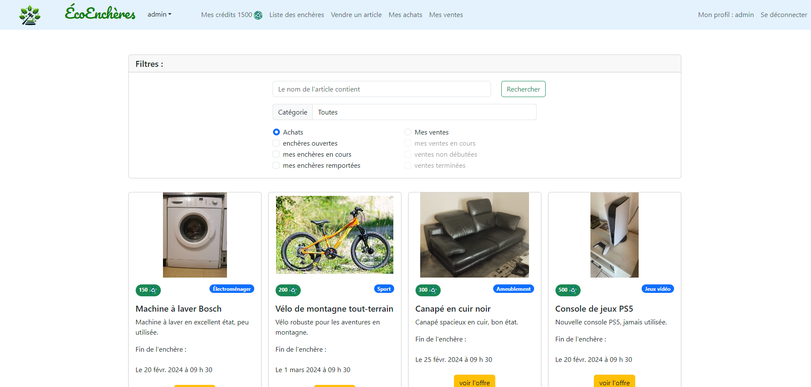
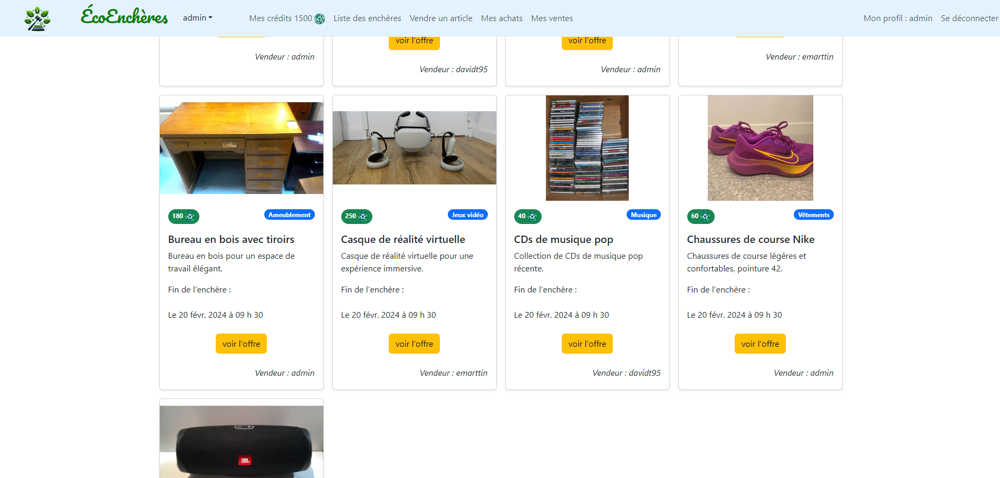
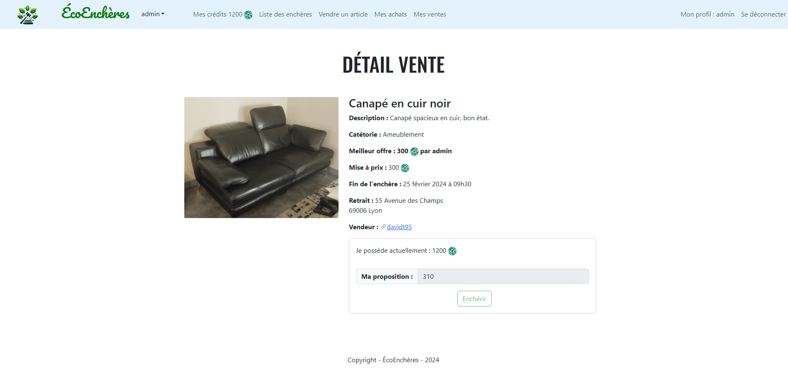
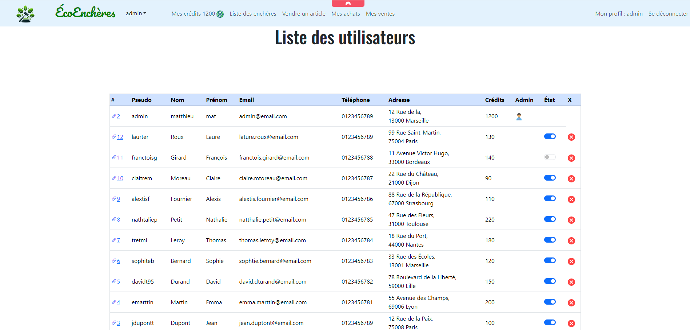
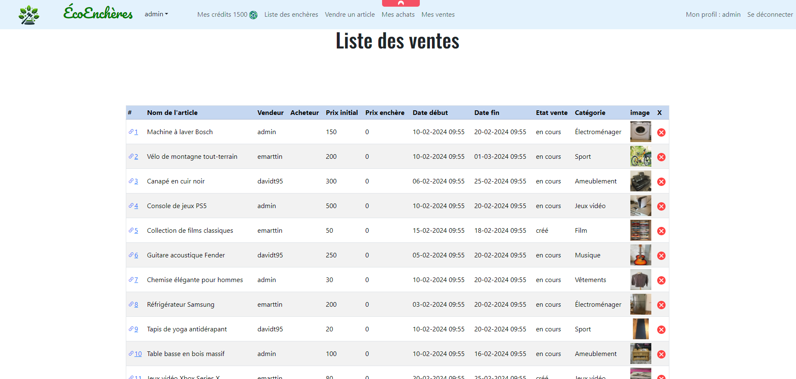

#   ÉcoEnchères 

## Présentation du projet

L’association « Les objets sont nos amis » souhaite monter une plateforme web pour 
permettre la cession d’objets de seconde main sans transaction financière. La valeur des 
articles sera déterminée par un système d’enchères basé sur un nombre de points. Les 
points seront gagnés en vendant des objets, puis pourront être utilisés pour acquérir d’autres 
objets.

## Librairies

### Java

- [JDK-17](https://www.oracle.com/java/technologies/javase/jdk17-archive-downloads.html)
- [JSTL-1.2](https://mvnrepository.com/artifact/javax.servlet.jsp.jstl/jstl)

### Base de données

- [Microsoft SQL Server 2019](https://www.microsoft.com/fr-fr/sql-server/sql-server-2019)
- [JDBC-12.4.2.jre8](https://mvnrepository.com/artifact/com.microsoft.sqlserver/mssql-jdbc/12.4.2.jre8)

### Serveur d'applications

- [Tomcat-9.0](https://tomcat.apache.org/download-90.cgi)

## Images de l'application

### liste d'enchères en cours

### Article en vente

### Admin -  liste des utilisateurs

### Admin - liste des enchères

